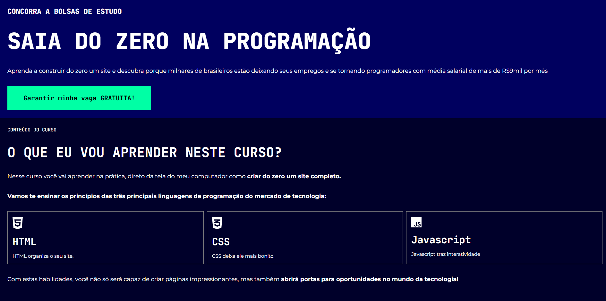

<h1>Landing Page - Kenzie</h1>

<h2>Sobre</h2>

Desafio proposto pela Kenzie Academy em uma imersão Desafio Programação do Zero

<h2>Funcionalidades</h2>

Landing page

Design responsivo

Abertura de um formuláio

<h2>Preview:</h2>

<h2>Acesse o projeto</h2>

Link do site: https://thiagoyamada.github.io/desafio-kenzie/

<h2>Autor</h2>

Thiago Yamada

Linkedin: https://www.linkedin.com/in/thiago-yudi/

## Tecnologias

  
  
  

